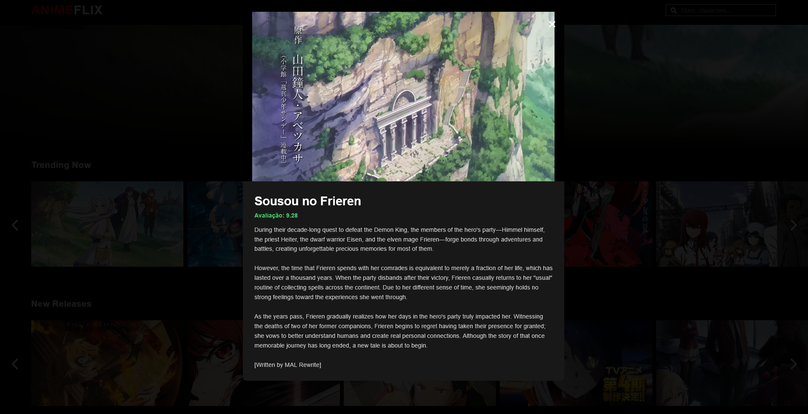

# 🎬 ANIMEFlix

<p align="center">
  
  
  
  
</p>

> **ANIMEFlix** is a dynamic web application that allows users to explore their favorite animes using the Jikan API (Unofficial MyAnimeList API).

## 🚀 Live Demo
https://lucasryanc.github.io/ANIMEFlix/

---

## 📸 Screenshots

Aqui você deve colocar as imagens do seu site. 
Dica: Tire um print da tela principal e coloque aqui.

| Home Screen | Anime Details |
| :---: | :---: |
|  |  |

---

## ✨ Features

- **Real-time Search:** Find any anime available on the database.
- **Top Anime List:** Stay updated with the most popular animes.
- **Detailed Information:** View synopses, ratings, and release dates.
- **Responsive Design:** Fully optimized for mobile and desktop screens.
- **Dynamic Content:** Data fetched in real-time using the Jikan API.

## 🛠️ Technologies Used

- **HTML5** & **CSS3** (Advanced Layout & Responsiveness)
- **JavaScript (ES6+)** (DOM Manipulation & Fetch API)
- **Jikan API** (External Data Source)

## 📖 How to Run the Project

1. Clone this repository:
   ```bash
   git clone [https://github.com/LucasRyanC/ANIMEFlix.git](https://github.com/LucasRyanC/ANIMEFlix.git)
